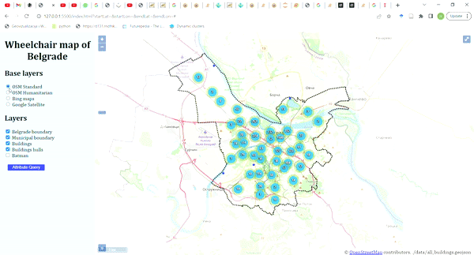
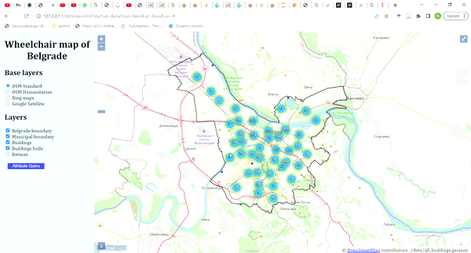
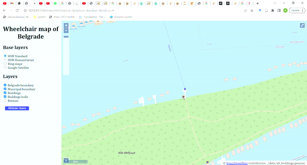
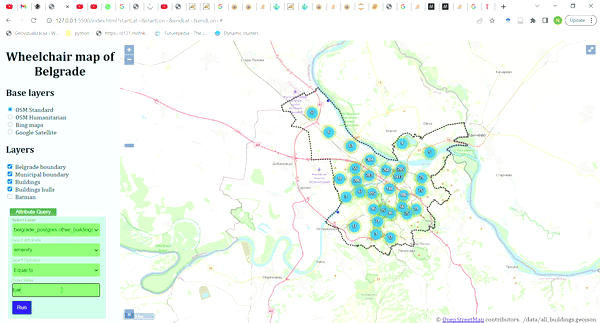

# Web GIS Application for Improved Urban Wheelchair Accessibility

## Project Challenges and Technological Exploration
I encountered challenges with the general methodology of this project, particularly in assessing its actual benefits for wheelchair users. As such, the application's current value is relatively low. My proposed solution involves conducting fieldwork to identify sidewalk and public transport obstacles, which vary based on each city's unique conditions. Additionally, there are community-specific issues highlighted in literature that I haven't addressed due to the absence of fieldwork.

On the technological front, I invested considerable time in trying to professionalize the project's appearance and structure, utilizing UML for system modeling and an ERD tool with Postgres to create an object-oriented database schema. Unfortunately, I faced difficulties optimizing the database to maximize performance for the web app's complex backend. My plan included implementing multiple interconnected databases with varying user roles to modify different sections of the database. Additionally, I aimed for a more sophisticated client-side experience using Node.js and Webpack to enhance modularity in JavaScript code. While researching, many online sources recommended using build tools and bundlers, leading me to choose Webpack and Node.js for project setup. Despite this, I discovered that OpenLayers' quickstart guide enabled rapid development. Ultimately, due to time constraints, I abandoned these efforts and reverted to a simpler setup, which left me feeling disappointed and regretful.

Lastly, I spent several days setting up GeoServer and attempting to connect my JavaScript file with a Python script (using Flask) to calculate optimal routes using the OpenRouteService library. I was confident in my ability to establish this connection but ultimately had to abandon it due to time constraints.

## Project Description

The Web GIS interface features a left sidebar and a map on the right. It incorporates four base layers, including Belgrade boundaries and municipalities served as a GeoJSON file from a local folder. Building data was sourced from OpenStreetMap (OSM) and imported into Postgres using osm2pgsql. Expanding the project's scope to potentially become a public participation/citizen science initiative required restyling the buildings. They were clustered based on scale parameters, distance, and building count. However, this clustering could not support pop-up interactions upon clicking. To address this, I added a transparent vector layer from the same GeoJSON file to enable pop-up functionality upon double-clicking. Convex hulls, as recommended by OpenLayers, were implemented to enhance visual features.

Interactive querying of GeoServer layers was achieved using AJAX, where a user can select a layer and attribute to query the database. The request is sent as a Web Feature Service (WFS) with selected parameters, and results are displayed as a new layer on the map. Efforts were also made to integrate routing options; initially exploring Leaflet before attempting a Python Flask script for route calculation, albeit unsuccessful due to interface integration challenges.

To complement this report, I included below four GIFs demonstrating the user experience, as this would not be possible if you would just clone the repo, due to the initial local hosting of GeoServer. 

### Layer switcher

### Convex hulls and clustering

### Pop-up

### Attribute query

